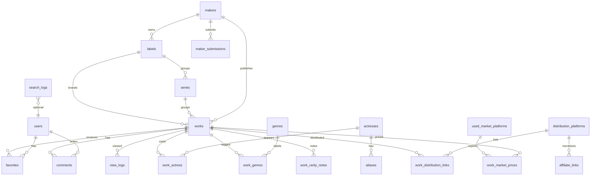

# 作品カタログDB 設計

## 0. 前身プロジェクトからの変更点

このプロジェクトは `seo-db-initial-project` の企画を、以下の方針で再設計したものです。

- **出演者の身元特定機能を廃止**。`credit_status`(candidate/verified_uncredited)、`appearance_context`(amateur_billed)、`cast_suggestions`、`/api/face-search`、`/api/cast-suggestions` は実装しない。
- **出演者情報は公式クレジットのみを正とする**。メーカー/レーベルが作品に公式にクレジットした情報だけを保存・表示する。未クレジット作品への出演者補完は行わない。
- **別名・旧芸名は本人/所属事務所が公式に発表したものだけを保存する**。第三者による推測・画像照合・crowd sourcingでの人物特定は行わない。
- **チア/グラビアなど、成人向け作品と無関係な実在人物の横断追跡・人気ランキング(`talents`統合構想)は今回のスコープから完全に除外**。将来的に検討する場合も、身元特定・カテゴリ横断の紐付けを伴わない形で別途設計する。
- **検索・発見体験の起点を「作品名・品番・メーカー・レーベル・シリーズ・ジャンル」に置く**。人物起点の「この子誰？」を導線の核にしない。
- 権利者(メーカー/レーベル)からの公式な情報提出・修正チャネルを新設し、情報の網羅性はここで担保する。
- **第二の収益核として、廃盤・希少タイトルの中古市場相場情報を追加**(詳細は [`docs/used-market-pricing.md`](./used-market-pricing.md))。相場・ランキングは常に作品(`works`)単位で持たせ、女優個人への新規スコアは設けない。
- **第三の収益核として、審査済み法人向けのデータ/API提供を追加**(詳細は [`docs/collector-data-services.md`](./collector-data-services.md))。提供対象は法人のみ、提供データはCore 1/Core 2のカタログ・相場情報の集計値に限り、ユーザー個人データ・未承認情報は一切提供しない。

## 1. ディレクトリ構成

```txt
src/
  app/
    page.tsx
    layout.tsx
    sitemap.ts
    robots.ts
    search/page.tsx
    ranking/page.tsx
    works/page.tsx
    works/[slug]/page.tsx
    actresses/page.tsx
    actresses/[slug]/page.tsx
    makers/page.tsx
    makers/[slug]/page.tsx
    labels/page.tsx
    labels/[slug]/page.tsx
    series/page.tsx
    series/[slug]/page.tsx
    genres/page.tsx
    genres/[slug]/page.tsx
    platforms/page.tsx
    platforms/[slug]/page.tsx
    used-market/page.tsx
    used-market/ranking/page.tsx
    admin/page.tsx
    api/
      search/route.ts
      comments/route.ts
      favorites/route.ts
      rankings/route.ts
      maker-submissions/route.ts
      used-market/prices/route.ts
      used-market/ranking/route.ts
      price-watch/route.ts
  components/
    AppHeader.tsx
    Breadcrumbs.tsx
    JsonLd.tsx
    SearchBox.tsx
    Section.tsx
    WorkCard.tsx
    ActressCard.tsx
    TagCloud.tsx
    OfficialInfoNotice.tsx
    UsedMarketCompareTable.tsx
  lib/
    constants.ts
    data.ts
    mock-data.ts
    seo.ts
    supabase.ts
    schemas.ts
  types/
    database.ts
supabase/
  schema.sql
docs/
  architecture.md
  seo-affiliate-aio-llmo.md
  platform-coverage.md
  monetization-site-design.md
  used-market-pricing.md
  collector-data-services.md
```

`/api/v1/partner/...`(法人向けデータAPI、詳細は [`docs/collector-data-services.md`](./collector-data-services.md))はサイト本体のユーザー向けAPIとは名前空間を分離し、`admin/page.tsx`に契約先(`data_partners`)の審査・APIキー発行機能を追加する。

`/api/face-search`、`/api/cast-suggestions` は実装しない。`admin/page.tsx` はメーカー提出情報のレビュー画面とする(出演者候補の承認画面ではない)。

## 2. ER図



## 3. Supabaseテーブル

- `users`: Supabase Auth連携プロフィール。
- `actresses`: 女優マスタ。公式クレジットに基づく名前・読み方・プロフィールのみ保持する。
- `aliases`: 本人/所属事務所が公式に発表した旧芸名・別名・読み・ローマ字表記。`source_type`で出典を必須管理する(第三者推測は保存しない)。
- `works`: 作品メタデータ、品番、許諾済みサムネイルURL、SEO説明文。
- `makers`: メーカー。
- `series`: シリーズ。
- `genres`: ジャンル/タグ。
- `work_actress`: 作品と女優の中間テーブル。**公式クレジットのみ**を保存する(候補・未クレジット確認済みの区分は持たない)。
- `work_genres`: 作品とジャンルの中間テーブル。
- `favorites`: ログインユーザーのお気に入り。
- `comments`: コメント、匿名名、いいね数、通報数。
- `view_logs`: 閲覧ログ(作品単位。個人=出演者を紐づけた閲覧ログは取得しない)。
- `search_logs`: 検索ログ。
- `distribution_platforms`: FANZA、SOD、MGS動画、DUGA/APEXなど国内大手配信・販売プラットフォーム。
- `work_distribution_links`: 作品ごとの公式/提携先掲載URL、販売形態、地域メモ。
- `platform_payment_methods`: プラットフォーム別・地域別の決済説明。
- `maker_submissions`: メーカー/レーベルからの公式情報提出・修正依頼(新設)。
- `used_market_platforms`, `work_market_prices`, `work_rarity_notes`, `price_watch_subscriptions`: 中古市場相場情報(第二の収益核、詳細は [`docs/used-market-pricing.md`](./used-market-pricing.md))。
- `data_partners`, `data_partner_api_keys`, `data_partner_api_usage_logs`: 法人向けデータ/API提供(第三の収益核、詳細は [`docs/collector-data-services.md`](./collector-data-services.md))。

## 4. API一覧

| Method | Path | 用途 | キャッシュ |
| --- | --- | --- | --- |
| GET | `/api/search?q=&type=` | 作品/品番/女優/メーカー/シリーズ/タグ横断検索 | `s-maxage=60` |
| GET/POST | `/api/comments` | コメント取得/投稿 | GETのみ短期キャッシュ |
| POST/DELETE | `/api/favorites` | お気に入り追加/削除 | no-store |
| GET | `/api/rankings?type=` | 作品/メーカー/レーベル単位のランキング(閲覧・検索・お気に入り) | `s-maxage=300` |
| POST | `/api/maker-submissions` | 権利者(メーカー/レーベル)による公式情報の提出・修正依頼 | no-store |
| GET | `/api/used-market/prices?workId=` | 作品の中古相場取得 | 15分 |
| GET | `/api/used-market/ranking` | プレミア価格ランキング | 15分 |
| POST | `/api/price-watch` | 価格変動通知の登録 | no-store |

`/api/rankings` は**作品・メーカー・レーベル単位**のランキングのみを扱う。女優個人の「人気スコア」ランキングは設けない(出演作品の人気は作品側の指標として集計する)。

## 5. ページ一覧

- `/`: トップ、検索、人気作品、最近追加、ランキング、タグ/メーカー/シリーズ導線。
- `/search`: 検索結果(作品名・品番・メーカー・レーベル・シリーズ・タグ・女優名の横断検索)。
- `/works`: 作品一覧。
- `/works/[slug]`: 作品詳細、構造化データ、FAQ、関連作品。廃盤/希少タイトルは中古相場セクションも表示する。
- `/actresses`: 女優一覧(公式クレジットのある作品を持つ女優のみ)。
- `/actresses/[slug]`: 女優プロフィール、公式クレジット済み出演作品、公式発表済み別名。
- `/makers`, `/makers/[slug]`: メーカー一覧/詳細。
- `/series`, `/series/[slug]`: シリーズ一覧/詳細。
- `/genres`, `/genres/[slug]`: タグ一覧/詳細。
- `/platforms`, `/platforms/[slug]`: 配信サイト一覧/詳細。FANZA、SOD、MGS動画、DUGA/APEXなど。
- `/ranking`: 作品・メーカー・レーベル単位のランキング。
- `/used-market`: 中古市場価格ガイドのトップ(プレミア価格ランキング、廃盤/希少タイトル特集)。
- `/used-market/ranking`: プレミア価格ランキング詳細。
- `/admin`: メーカー提出情報のレビュー画面。
- `/sitemap.xml`, `/robots.txt`: Metadata Routes。

## 6. コンポーネント一覧

- `AppHeader`: 黒ベースの固定ヘッダー。
- `SearchBox`: SSRページで使えるGETフォーム検索。
- `Section`: 見出し付きレール。
- `WorkCard`: 作品カード。
- `ActressCard`: 女優カード(公式クレジット済み出演作品数のみ表示)。
- `TagCloud`: タグ/メーカー/シリーズ導線。
- `Breadcrumbs`: パンくず。
- `JsonLd`: JSON-LD出力。
- `OfficialInfoNotice`: 出演者情報が未クレジットの作品に表示する注記コンポーネント(新設)。「本サイトは独自に出演者を特定しません。公式サイトの最新情報をご確認ください」という趣旨の文言と、当該プラットフォームの作品ページへの外部リンクのみを表示する。
- `UsedMarketCompareTable`: 中古相場をプラットフォーム別に比較表示するコンポーネント(新設)。価格・件数・取得日時・CTAを横並びで表示する(詳細は [`docs/used-market-pricing.md`](./used-market-pricing.md))。

## 出演者情報の扱い方針(再設計)

- `work_actress`は**公式クレジットのみ**を保存する。第三者投稿、管理者目視特定、AI顔画像検索、OCRによる出演者補完は行わない。
- 作品に公式クレジットが無い場合、出演者欄は「情報なし」とし、`OfficialInfoNotice`を表示して当該プラットフォームの公式作品ページへ外部リンクする。サイト内で候補者を推測・保存・公開することはしない。
- ユーザーからのお問い合わせで「出演者情報が誤っている」等の指摘があった場合は、`maker_submissions`経由でメーカー/レーベルに確認を依頼するフローに乗せる(ユーザーの推測をそのまま公開しない)。

## 別名・旧芸名の扱い方針(再設計)

- `actresses.name`は現在の代表名。
- `aliases`は、本人または所属事務所が公式に発表した名称のみを保存する。`source_type`は`official_agency`(事務所発表)、`official_credit`(過去作品の公式クレジット)のいずれかを必須とし、それ以外の出典(ユーザー推測、画像照合等)は保存しない。
- `aliases.alias_type`は`former_stage_name`, `alternate_stage_name`, `romanized`, `kana`。
- `aliases.valid_from`, `aliases.valid_to`で活動時期を記録する。
- 作品詳細では現在名を主表示し、作品内クレジット名が異なる場合のみ「クレジット: 旧名」と補足する(いずれも公式クレジット同士の対応関係であり、第三者による同定は行わない)。
- 素人名義出演・未クレジット出演の同定・紐付けは一切行わない。

## メーカー・レーベル仕様

- `makers`は企業または制作/販売元の親組織を表す。
- `labels`はメーカー配下のブランド、レーベル、サブブランドを表す。
- `series`は原則として`labels`配下に置き、必要に応じて`maker_id`も保持して検索を高速化する。
- `works`は`maker_id`, `label_id`, `series_id`を持つ。
- 階層は`maker -> label -> series -> work`を基本とする。
- レーベルが不明な作品は`label_id`を`null`にし、メーカー直下作品として扱う。
- レーベル名はSEOキーワードとして強いため、`/labels`と`/labels/[slug]`を独立したインデックス対象ページにする。
- 作品詳細ではメーカー、レーベル、シリーズをすべて表示し、それぞれ内部リンクする。
- 検索対象は作品名、品番、女優名(公式クレジット分のみ)、公式発表済み旧芸名、メーカー名、レーベル名、シリーズ名、タグ名を横断する。
- sitemapにはレーベル一覧、レーベル詳細を含める。
- パンくずは作品ページで`ホーム > メーカー > レーベル > シリーズ > 作品`を基本形にする。

## レーベル関連ページ

- `/labels`: レーベル一覧。
- `/labels/[slug]`: レーベル詳細。レーベル説明、所属メーカー、シリーズ一覧、作品一覧、(公式クレジットがある場合のみ)出演女優を表示。
- `/makers/[slug]`: メーカー詳細に配下レーベル一覧を表示。
- `/series/[slug]`: シリーズ詳細に所属レーベルとメーカーを表示。

## レーベル関連API

| Method | Path | 用途 | キャッシュ |
| --- | --- | --- | --- |
| GET | `/api/search?q=&type=label` | レーベル名検索 | `s-maxage=60` |
| GET | `/api/rankings?type=label` | レーベル別ランキング(作品数・閲覧数ベース) | `s-maxage=300` |

## メーカー公式提出チャネル(新設)

- `/api/maker-submissions`は、メーカー/レーベルの担当者が自社作品の情報追加・修正(出演者クレジットの追加・訂正含む)を申請するための窓口。
- 提出者は担当企業名・連絡先・提出内容を送信し、`maker_submissions.status`は`pending`で保存される。
- サイト運営者が提出内容と提出元を確認できた場合のみ`approved`にし、`works`/`work_actress`/`aliases`へ反映する。確認できない提出は`rejected`とし、一切公開しない。
- この仕組みは「第三者による特定」ではなく「権利者本人からの公式情報提供」のみを受け付ける点が従来案との違い。
